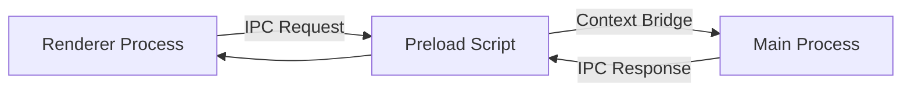

## Overview

Code Editor Thing is built as a desktop application using Electron, combining web technologies (React + TypeScript) with native desktop capabilities. The architecture follows a clear separation between the main process (Node.js) and the renderer process (React).

## Technology Stack

<CardGroup cols={2}>
  <Card title="Electron" icon="cube">
    Desktop application framework providing native OS integration
  </Card>
  <Card title="React 18" icon="react">
    UI library for building the editor interface
  </Card>
  <Card title="TypeScript" icon="code">
    Type-safe development across main and renderer processes
  </Card>
  <Card title="CodeMirror 6" icon="file-code">
    Core text editor component with syntax highlighting
  </Card>
  <Card title="Vite" icon="bolt">
    Build tool for fast development and optimized production builds
  </Card>
  <Card title="Tailwind CSS" icon="palette">
    Utility-first CSS framework for styling
  </Card>
</CardGroup>

## Process Architecture

### Main Process

The main process (`electron/main.ts:13-48`) manages the application lifecycle, native OS interactions, and file system operations.

**Key Responsibilities:**
- Window creation and management
- File system operations (read/write)
- Native menu and keyboard shortcuts
- Terminal process management via node-pty
- IPC communication with renderer

```typescript
// Main window configuration
const mainWindow = new BrowserWindow({
  width: 1200,
  height: 800,
  webPreferences: {
    nodeIntegration: false,
    contextIsolation: true,
    preload: path.join(APP_PATH, 'dist-electron/preload.cjs')
  }
})
```

<Note>
  The main process runs Node.js with full system access, while the renderer process is sandboxed for security.
</Note>

### Renderer Process

The renderer process (`src/App.tsx`) runs the React application that users interact with. It's isolated from Node.js for security but communicates with the main process via IPC.

**Key Components:**
- Editor interface (CodeMirror)
- Sidebar with file tree
- Tab management for open files
- Theme system

## Component Architecture

### Core Components

<Steps>
  <Step title="App Component">
    Root component that wraps the entire application with `EditorProvider` for global state management (`src/App.tsx:51-57`).
  </Step>
  
  <Step title="Editor Component">
    Manages CodeMirror instances, syntax highlighting, and content editing (`src/components/Editor.tsx`). Creates new editor instances when switching between files.
  </Step>
  
  <Step title="Sidebar Component">
    Displays hierarchical file tree with expandable folders (`src/components/Sidebar.tsx`). Lazy-loads directory contents on expansion.
  </Step>
  
  <Step title="Terminal Component">
    Integrates xterm.js with node-pty for embedded terminal functionality.
  </Step>
</Steps>

### Component Hierarchy

```bash
App
├── EditorProvider (Context)
│   └── EditorApp
│       ├── Sidebar
│       │   ├── TreeItem (recursive)
│       │   └── InfoBar
│       └── Editor
│           ├── OpenFiles (tabs)
│           └── CodeMirror View
```

## State Management

### EditorContext

The application uses React Context (`src/lib/editor-context.tsx`) for centralized state management instead of external libraries.

**Managed State:**
- `fileTree`: Directory structure from current folder
- `openFiles`: Array of currently open file tabs
- `activeFilePath`: Currently focused file
- `sidebarVisible/terminalVisible`: UI panel visibility
- `selectedTheme`: Current color theme
- `currentFolder`: Root folder path

```typescript
const EditorContext = createContext<EditorContextType | null>(null)

export function useEditor() {
  const context = useContext(EditorContext)
  if (!context) {
    throw new Error('useEditor must be used within EditorProvider')
  }
  return context
}
```

**Key Operations:**
- `handleFileSelect`: Opens files and manages tab state (`src/lib/editor-context.tsx:61-83`)
- `handleContentChange`: Tracks file modifications (`src/lib/editor-context.tsx:85-95`)
- `handleSave`: Persists changes via IPC (`src/lib/editor-context.tsx:97-109`)
- `handleRefreshTree`: Reloads directory contents (`src/lib/editor-context.tsx:121-125`)

## IPC Communication

### Communication Flow



### Preload Bridge

The preload script (`electron/preload.ts`) safely exposes IPC methods to the renderer via `contextBridge`:

```typescript
contextBridge.exposeInMainWorld('electronAPI', {
  readDirectory: (dirPath: string) => ipcRenderer.invoke('read-directory', dirPath),
  readFile: (filePath: string) => ipcRenderer.invoke('read-file', filePath),
  saveFile: (filePath: string, content: string) => ipcRenderer.invoke('save-file', filePath, content),
  onFolderOpened: (callback) => ipcRenderer.on('folder-opened', callback),
  onToggleSidebar: (callback) => ipcRenderer.on('toggle-sidebar', callback)
})
```

### IPC Handlers

**File Operations** (`electron/main.ts:104-138`):
- `read-directory`: Lists directory contents with sorting
- `read-file`: Reads file content as UTF-8
- `save-file`: Writes file content to disk
- `get-folder`: Returns current workspace folder

**Terminal Operations** (`electron/main.ts:142-166`):
- `create-terminal`: Spawns PTY process
- `terminal-input`: Sends input to PTY
- `terminal-data`: Streams output to renderer

**Global Shortcuts** (`electron/main.ts:39-45`):
- `Command+B`: Toggle sidebar
- `Command+Shift+T`: Toggle terminal
- `Command+O`: Open folder (via menu)

<Note>
  All IPC communication uses `invoke/handle` for request-response patterns and `send/on` for events, ensuring type safety and proper error handling.
</Note>

## File Structure

```bash
code-editor-thing/
├── electron/
│   ├── main.ts           # Main process entry
│   └── preload.ts        # IPC bridge
├── src/
│   ├── components/
│   │   ├── Editor.tsx    # CodeMirror wrapper
│   │   ├── Sidebar.tsx   # File tree
│   │   ├── Terminal.tsx  # xterm.js integration
│   │   └── open-files.tsx # Tab bar
│   ├── lib/
│   │   ├── editor-context.tsx  # State management
│   │   ├── themes.ts     # Color themes
│   │   └── utils.ts      # CodeMirror config
│   ├── App.tsx           # Root component
│   └── main.tsx          # React entry point
├── dist/                 # Vite build output
└── dist-electron/        # Electron build output
```

## Security Model

<Steps>
  <Step title="Context Isolation">
    Renderer process cannot directly access Node.js APIs
  </Step>
  
  <Step title="Preload Script">
    Only explicitly exposed methods are available via `window.electronAPI`
  </Step>
  
  <Step title="Node Integration Disabled">
    Prevents arbitrary code execution in the renderer
  </Step>
  
  <Step title="IPC Validation">
    Main process validates all file paths and operations
  </Step>
</Steps>

This architecture ensures a secure, maintainable codebase while providing the performance and features users expect from a native code editor.