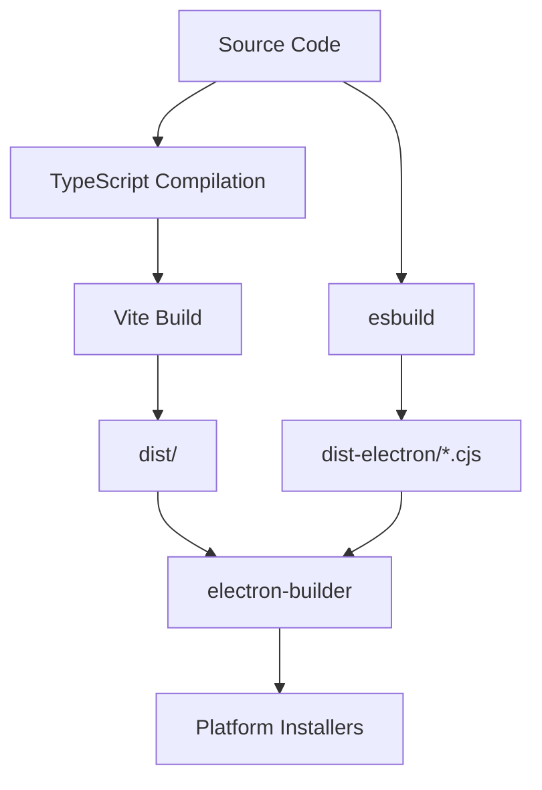

## Development Setup

<Steps>
  <Step title="Install Dependencies">
    Install all required npm packages including Electron, React, and CodeMirror:
    
    ```bash
    npm install
    ```
    
    This also runs `electron-builder install-app-deps` via the postinstall script to install native dependencies.
  </Step>
  
  <Step title="Start Development Server">
    Run the Vite development server for hot module reloading:
    
    ```bash
    npm run dev
    ```
    
    The dev server starts at `http://localhost:5173` by default.
  </Step>
  
  <Step title="Launch Electron (Optional)">
    To test in the Electron environment during development:
    
    ```bash
    npm run electron:dev
    ```
    
    This builds the Electron main process and starts the app.
  </Step>
</Steps>

<Note>
  The app detects whether it's running in Electron. If you only run `npm run dev`, you'll see a message to launch Electron for full functionality.
</Note>

## Build Commands

All build commands are defined in `package.json:9-16`.

### Development Builds

<CodeGroup>

```bash Web Only
npm run dev
```

```bash Electron Dev
npm run electron:dev
```

```bash Preview Production Build
npm run preview
```

</CodeGroup>

### Production Builds

<Steps>
  <Step title="Build Renderer Process">
    Compile TypeScript and build the React app with Vite:
    
    ```bash
    npm run build
    ```
    
    This runs:
    1. `tsc` - Type checking
    2. `vite build` - Bundles React app to `dist/`
    
    <Note>
      The build output goes to the `dist/` directory.
    </Note>
  </Step>
  
  <Step title="Build Main Process">
    Compile the Electron main process and preload script:
    
    ```bash
    npm run build:electron
    ```
    
    This executes `build-electron.mjs` which uses esbuild to bundle:
    - `electron/main.ts` → `dist-electron/main.cjs`
    - `electron/preload.ts` → `dist-electron/preload.cjs`
  </Step>
  
  <Step title="Package Application">
    Create distributable packages for your platform:
    
    ```bash
    npm run electron:build
    ```
    
    This command:
    1. Builds the renderer (`vite build`)
    2. Builds the main process (`build:electron`)
    3. Runs `electron-builder` to create installers
  </Step>
</Steps>

## Electron Build Process

### Build Configuration

The Electron Builder configuration is defined in `package.json:66-85`:

```json
{
  "build": {
    "appId": "com.codeeditorthing.app",
    "productName": "Code Editor Thing",
    "directories": {
      "output": "dist-electron"
    },
    "mac": {
      "target": "dmg"
    },
    "files": [
      "dist/**/*",
      "dist-electron/main.cjs",
      "dist-electron/preload.cjs"
    ]
  }
}
```

### Build Outputs

<CardGroup cols={2}>
  <Card title="dist/" icon="folder">
    **Renderer Process**
    
    Vite-bundled React application:
    - `index.html`
    - JavaScript bundles
    - CSS files
    - Assets
  </Card>
  
  <Card title="dist-electron/" icon="folder">
    **Main Process & Packages**
    
    Electron files and installers:
    - `main.cjs` - Main process
    - `preload.cjs` - Preload script
    - Platform-specific installers (after `electron:build`)
  </Card>
</CardGroup>

## Platform-Specific Builds

### macOS

```bash
npm run electron:build
```

Produces:
- `dist-electron/Code Editor Thing.dmg` - DMG installer
- `dist-electron/mac/Code Editor Thing.app` - Application bundle

### Windows

Electron Builder auto-detects the platform. On Windows, it creates:
- `.exe` installer
- Unpacked application directory

<Note>
  Modify the `build.mac` section in `package.json` to `build.win` for Windows-specific settings.
</Note>

### Linux

Add Linux configuration to `package.json`:

```json
"linux": {
  "target": ["AppImage", "deb"]
}
```

## Build Workflow



## Development vs Production

| Aspect | Development | Production |
|--------|-------------|------------|
| **Renderer** | Vite dev server (HMR) | Static files in `dist/` |
| **Main Process** | Rebuilt on changes | Pre-built `.cjs` files |
| **URL** | `http://localhost:5173` | `file://` protocol |
| **DevTools** | Auto-open | Disabled |
| **Source Maps** | Enabled | Optional |

## Optimization Tips

<Steps>
  <Step title="Code Splitting">
    Vite automatically splits vendor code. Large dependencies like CodeMirror are bundled separately for better caching.
  </Step>
  
  <Step title="Tree Shaking">
    Import only what you need from libraries:
    
    ```typescript
    // Good
    import { EditorView } from "codemirror"
    
    // Avoid
    import * as CM from "codemirror"
    ```
  </Step>
  
  <Step title="Asset Optimization">
    Vite optimizes assets during build. Place images in `src/assets/` to benefit from automatic optimization.
  </Step>
  
  <Step title="ASAR Packaging">
    The app uses ASAR archives (`"asar": true`) to package files into a single archive for faster startup.
  </Step>
</Steps>

## Troubleshooting

<AccordionGroup>
  <Accordion title="Build fails with TypeScript errors">
    Run type checking separately to see detailed errors:
    
    ```bash
    npx tsc --noEmit
    ```
  </Accordion>
  
  <Accordion title="Electron window shows blank screen">
    Check the Electron dev tools console. Common issues:
    - Preload script path is incorrect
    - Vite dev server isn't running
    - Content Security Policy blocking resources
  </Accordion>
  
  <Accordion title="Native modules fail to load">
    Rebuild native dependencies for Electron:
    
    ```bash
    npm run postinstall
    ```
    
    This re-runs `electron-builder install-app-deps`.
  </Accordion>
  
  <Accordion title="electron-builder packaging fails">
    Ensure all files are present:
    - `dist/` directory exists (run `npm run build`)
    - `dist-electron/main.cjs` exists (run `npm run build:electron`)
    - No path errors in `package.json` build config
  </Accordion>
</AccordionGroup>

## Next Steps

<CardGroup cols={2}>
  <Card title="Architecture" icon="sitemap" href="/development/architecture">
    Understand the codebase structure
  </Card>
  <Card title="Contributing" icon="code-pull-request" href="/development/contributing">
    Learn how to contribute changes
  </Card>
</CardGroup>